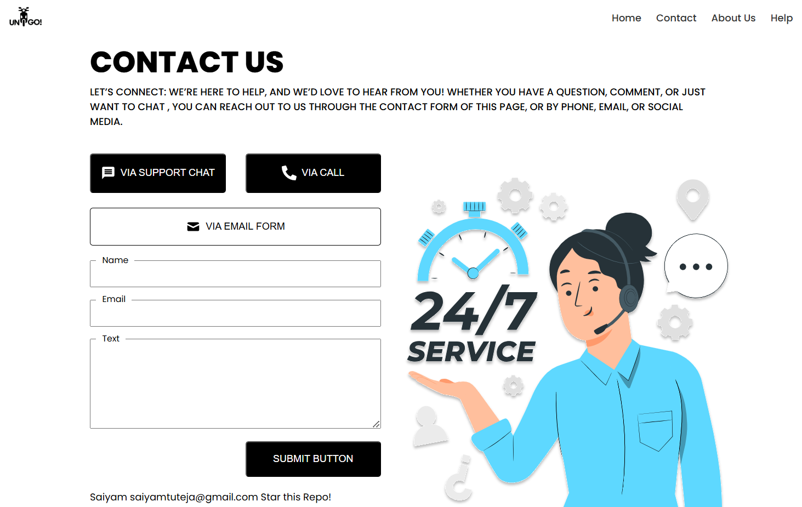

# Contact Us Page - React Project

This project is a **Contact Us Page** built using **React**, designed as a hands-on learning experience for understanding React concepts, components, CSS modules, and React Icons. The application provides a user-friendly interface for collecting user input and dynamically displays the submitted data on the same screen.

---

## 🚀 Features

- **React Components**:
  - **Navigation**: A simple navigation bar for the page.
  - **Contact Header**: A header for the "Contact Us" section.
  - **Contact Form**: A form to collect user input.
  - **Button**: A reusable button component.
- **CSS Modules** for modular and scoped styling.
- Integration of **React Icons** for improved visual appeal.
- Displays user-entered data dynamically on the screen.
- Includes an **image** from the `public` folder for additional design elements.

---

## 📂 Project Structure

```
Contact-Us/
├── public/
│   ├── contact-image.jpg   # Image used in the project
│   └── index.html          # Entry HTML file
├── src/
│   ├── components/
│   │   ├── Navigation.js       # Navigation bar component
│   │   ├── ContactForm.js      # Contact form component
│   │   ├── Button.js           # Button component
│   │   └── ContactHeader.js    # Contact header component
│   ├── styles/
│   │   ├── Navigation.module.css  # CSS module for Navigation
│   │   ├── ContactForm.module.css # CSS module for ContactForm
│   │   └── Button.module.css      # CSS module for Button
│   ├── App.js                # Main React component
│   ├── App.css               # Global styling
│   ├── index.js              # Entry JavaScript file
│   └── reportWebVitals.js    # Optional performance monitoring
├── package.json              # Project configuration file
└── README.md                 # Project README file
```

---

## 🛠️ Installation and Setup

Follow these steps to set up and run the project locally:

### 1. Prerequisites

- Ensure you have **Node.js** and **npm** or **yarn** installed.
  - [Download Node.js](https://nodejs.org/)

### 2. Clone the Repository

```bash
git clone https://github.com/your-username/contact-us-page.git
cd contact-us-page
```

### 3. Install Dependencies

Install the necessary packages:

```bash
npm install
```

### 4. Start the Development Server

Run the following command to start the app:

```bash
npm start
```

The app will be accessible at `http://localhost:3000` in your browser.

---

## 🖥️ Usage

1. **Enter Data**: Fill out the contact form fields (e.g., Name, Email, Message).
2. **View Data**: The entered data is displayed dynamically on the same page after submission.
3. **Navigation**: Use the **Navigation** component to understand React routing basics (if applicable).
4. **Styling**: Explore the modular CSS used for styling individual components.

---

## ✨ Highlights of the Project

- **React Basics**: Hands-on learning with functional components.
- **Dynamic Data Display**: User input is shown in real-time on the same screen.
- **CSS Modules**: Scoped and maintainable styles for individual components.
- **React Icons**: Icons enhance the look and feel of the application.
- **Public Folder**: Includes an image for better design.

---

## 📋 Example Code

Here’s an example of the **Contact Form Component**:

```jsx
import React, { useState } from "react";
import styles from "./ContactForm.module.css";

const ContactForm = () => {
  const [formData, setFormData] = useState({
    name: "",
    email: "",
    message: "",
  });

  const handleChange = (e) => {
    setFormData({ ...formData, [e.target.name]: e.target.value });
  };

  return (
    <div className={styles.contactForm}>
      <h2>Contact Us</h2>
      <form>
        <input
          type="text"
          name="name"
          placeholder="Your Name"
          value={formData.name}
          onChange={handleChange}
        />
        <input
          type="email"
          name="email"
          placeholder="Your Email"
          value={formData.email}
          onChange={handleChange}
        />
        <textarea
          name="message"
          placeholder="Your Message"
          value={formData.message}
          onChange={handleChange}
        ></textarea>
        <button type="button">Submit</button>
      </form>
      <div className={styles.output}>
        <h3>Entered Data:</h3>
        <p>
          <strong>Name:</strong> {formData.name}
        </p>
        <p>
          <strong>Email:</strong> {formData.email}
        </p>
        <p>
          <strong>Message:</strong> {formData.message}
        </p>
      </div>
    </div>
  );
};

export default ContactForm;
```

---

## 🤝 Contribution

Contributions are welcome! If you'd like to contribute:

1. Fork the repository.
2. Create a new branch (`git checkout -b feature-name`).
3. Make your changes and commit them (`git commit -m "Add feature"`).
4. Push to the branch (`git push origin feature-name`).
5. Open a pull request.

---

## 📞 Contact

If you have any questions or suggestions, feel free to reach out:

- **GitHub:** [your-username](https://github.com/your-username)
- **Email:** your-email@example.com

Happy learning and coding! 🚀


